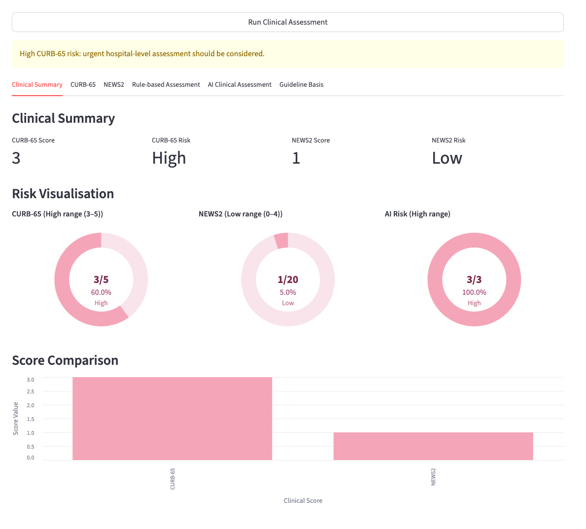
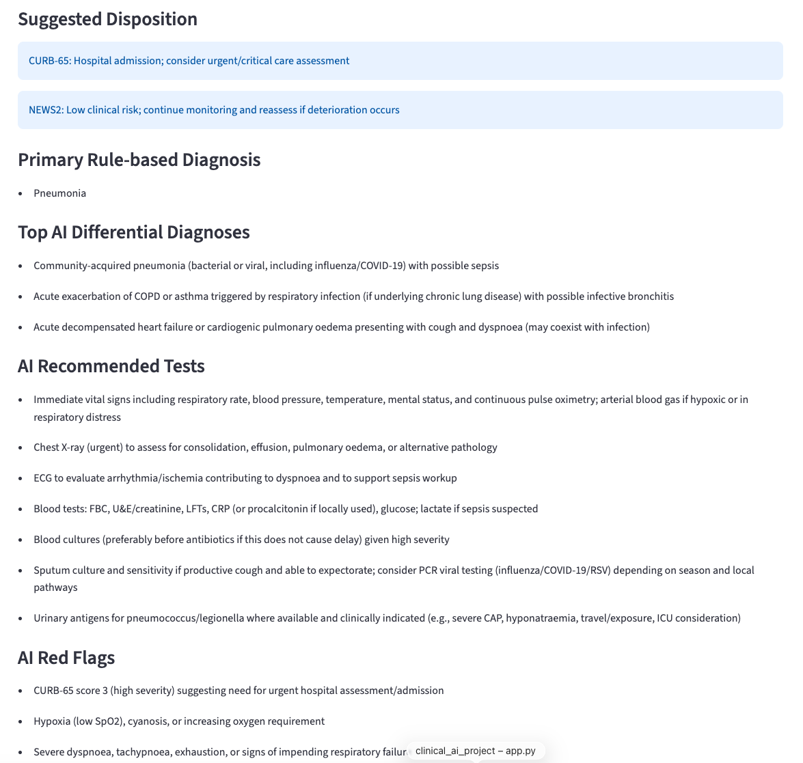
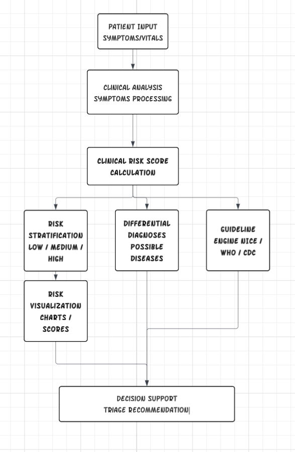

# AI Clinical Decision Support System
Guideline-Based Risk Stratification & Differential Diagnosis Tool

## Project Overview
This project is an AI-assisted clinical decision support system designed to support clinical risk assessment, triage, and differential diagnosis using evidence-based clinical scoring systems and international medical guidelines.

The system integrates multiple clinical scoring tools such as NEWS2, Wells Score, and Centor Criteria, and provides risk stratification, possible differential diagnoses, and guideline-based recommendations (NICE, WHO, CDC). The tool is designed for clinical decision support and educational purposes only, not for diagnosis.

This project demonstrates the application of AI in healthcare, clinical informatics, and digital health systems.

---

## Demo Interface

## System Workflow

---

## System Workflow

The system workflow:
1. Patient information input
2. Symptom and vital signs analysis
3. Clinical risk score calculation (NEWS2 / Wells / Centor)
4. Risk stratification (Low / Medium / High)
5. Differential diagnosis suggestions
6. Guideline-based recommendations
7. Risk visualization and decision support output

---

## Features
- NEWS2 Score automatic calculation
- Wells Score for Pulmonary Embolism
- Centor Score for Pharyngitis
- Risk Stratification (Low / Medium / High Risk)
- Differential Diagnosis Suggestions
- Guideline-Based Recommendations (NICE / WHO / CDC)
- Clinical Decision Support Interface
- Risk Visualization (Pie Chart / Risk Distribution)
- Streamlit-based interactive clinical tool

---

## Tech Stack
- Python
- Streamlit
- Pandas
- Matplotlib
- Clinical Scoring Systems (NEWS2, Wells Score, Centor Criteria)
- Clinical Decision Support Logic
- Evidence-Based Guideline Integration
- Digital Health Application Design

---

## Project Structure
